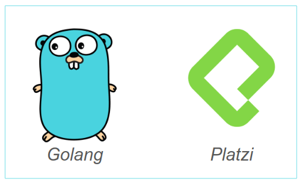

# Curso Básico de Programación en Go
"Go is an open source programming language that makes it easy to build simple, reliable, and efficient software."

 

## Indice de Notas y Codigo:
- [Hello World](./src/01_Hello-World)
- [Constantes](./src/02_Constantes)
- [Variables](./src/03_Variables)
- [Zero Values](./src/04_Zero-Values)
- [Operadores Matematicos](./src/06_Operadores-Matematicos)
- [Calcular el Ára de las figuras](./src/12_Area-Funciones):
    - [Cuadrado](./src/05_Area-Cuadrado)
    - [Rectangulo](./src/07_Area-Rectangulo)
    - [Trapecio](./src/08_Area-Trapecio)
    - [Circulo](./src/09_Area-Circulo)
- [Paquete fmt](./src/10_Paquete-FMT)
- [Funciones](./src/11_Funciones)
- [Ciclo For](./src/13_For)
- [Ciclo For While](./src/14_For-While)
- [Ciclo For Forever](./src/15_For-Forever)

### Otros Recursos Interesantes:
- [Curso Práctico de Go: Creación de un Servidor Web](https://platzi.com/clases/programacion-golang-2020)
- [Golang WebPage](https://golang.org)
- [Golang Packages](https://golang.org/pkg)
- [Guía de Instalación](https://golang.org/doc/install)
- [Blog de Go](https://blog.golang.org/go-brand)
- [Wikipedia](https://en.wikipedia.org/wiki/Go_(programming_language))
- [Gopherize Me](https://gopherize.me)
- [Adda Tutorial](https://www.w3adda.com/golang-tutorial)

### Datos del Profesor:
- [Twitter](https://twitter.com/osmandi)
- [GitHub](https://github.com/osmandi)
- [Pagina Personal](https://osmandi.com)
- [Platzi](https://platzi.com/p/osmandi)
