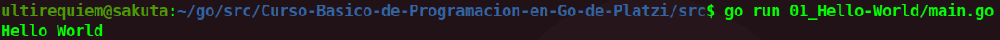

# Hello World en GO
El Hola mundo es considerado el Programa mas simple que se puede hacer en cualquier lenguaje.Consiste en mandar un output de texto a la terminal con un mensaje como "Hello World" o "Hola Mundo".
```bash
ultirequiem@sakuta:~$ go run main.go
¡Hola Mundo!
```
El Editor Recomendado para este curso es VSCode, si es que estas utilizando este editor es altamente recomendable instalar [esta extensión](https://marketplace.visualstudio.com/items?itemName=golang.go).

<div align="center">
<a href="https://youtu.be/Afq6LN892cY"></a>
</div>


## Continua la lectura:

- [Indice](./../../README.md)                                                                 

- [Capitulo Siguiente: Constantes](./../02_Constantes)
