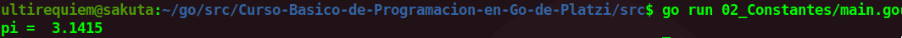

# Constantes
Las constantes son valores que nunca van a cambiar en el tiempo. Si es que tratas de cambiarle el valor, el runtime de Go dara un error, si es que necesitas poder cambiarle el valor lo que debes usar son [variables](./../03_Variables).

Declarar constantes en Go es muy intuitivo:
```go
func main() {
	const pi float64 = 3.1415
}
```
Aunque se puede declarar la constantes sin especificar el tipo(ejem.int,float64) lo recomendable es hacerlo para aumentar el rendimiento.

<div align="center">
<a href="https://youtu.be/Bcyzmikab8o"></a>
</div>

## Continua la lectura:
- [Capitulo Anterior: Hello World](./../01_Hello-World)                                                                 

- [Capitulo Siguiente: Variables](./../03_Variables)