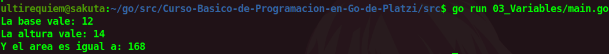

# Variables
Las variables son valores que pueden ir cambiando en diversas partes del codigo segun como lo especifiques, pero gastan mas recursos que las [constantes](./../02_Constantes).

Las variables se pueden declarar de varias formas:
```go
func main() {
	primeraForma := 1 //Bastante Parecida a Python
    	var segundaForma = 2 //Como en JavaScript
	var terceraForma int16 = 3 // Parecido a C++
}
```
Pero la forma que menos recursos gasta es la 3ra siendo la que especifica mas cosas y ahorra mas trabajo al compilador.

<div align="center">
<a href="https://youtu.be/a5NYAK-TXXE"></a>
</div>

## Continua la lectura:
- [Capitulo Anterior: Constantes](./../02_Constantes)                                                                 

- [Capitulo Siguiente: Zero Values](./../04_Zero-Values)
