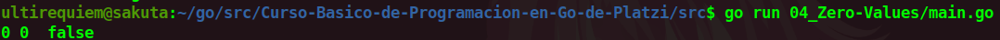

# Zero Values
Algo que se debe tomar en cuenta en GO es que si no especificas el valor de tu [constante](./../02_Constantes) o [variable](./03_Variables) a diferencia de otros lenguajes que le asignan un valor null, GO le dara los valores por Default.

### Valores por Default:
- **int** y sus derivados(int8,int16,uint,etc.) : 0
- **float32 y float64** : 0
- **string** : Un string vacio: " "
- **bool** : False

## Continua la lectura:
- [Capitulo Anterior: Variables](./../03_Variables)                                                                 

- [Capitulo Siguiente: Calcular el área del Cuadrado](./../05_Area-Cuadrado)