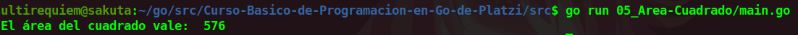

# Calcular el Área del cuadrado
Este es un programa simple que nos ayuda a calcular el área de un cuadrado suponiendo que cada uno de sus lados vale 24. La formula que se utiliza es **lado** por **lado**.

## Continua la lectura:
- [Capitulo Anterior: Zero Values](./../04_Zero-Values)                                                                 

- [Capitulo Siguiente: Operadores Matemáticos](./../06_Operadores-Matematicos)