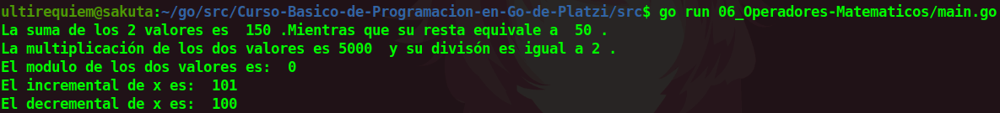

# Operadores Matemáticos
Los operadores matemáticos corrientes.

- Suma
- Resta 
- Multiplicación
- Divisíon
- Modulos
- Incrementales
- Decrementales

## Continua la lectura:
- [Capitulo Anterior: Calcular el Área de un Cuadrado](./../05_Area-Cuadrado)                                                                 

- [Capitulo Siguiente: Calcular el Área de un Rectangulo](./../07_Area-Rectangulo)