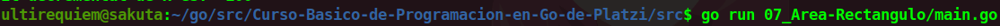

# Calcular el Área de un Rectángulo
Este es un programa simple que nos ayuda a calcular el área de un cuadrado suponiendo que uno de sus lados vale 100 y el otro 20. La formula que se utiliza es **lado** por **lado**.

## Continua la lectura:
- [Capitulo Anterior: Operadores Matemáticos](./../06_Operadores-Matematicos)                                                                 

- [Capitulo Siguiente: Calcular el área de un Trapecio](./../08_Area-Trapecio)