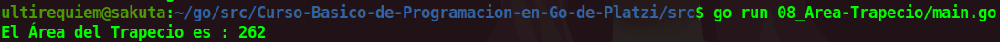

# Calcular el Área de un Trapecio
Este es un programa simple que nos ayuda a calcular el área de un Trapecio.

## Continua la lectura:
- [Capitulo Anterior: Calcular el Área de un Rectángulo](./../07_Area-Rectangulo)                                                                 

- [Capitulo Siguiente: Calcular el área de un Circulo](./../09_Area-Circulo)