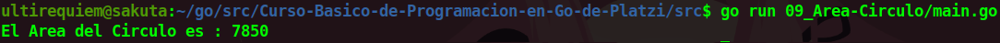

# Calcular el Área de un Circulo
Este es un programa simple que nos ayuda a calcular el área de un circulo suponiendo que su radio es de 50. La formula que se utiliza es **radio** por **pi**.

## Continua la lectura:
- [Capitulo Anterior: Calcular el Área de un Trapecio](./../08_Area-Trapecio)                                                                 

- [Capitulo Siguiente: El Paquete fmt](./../10_Paquete-FMT)