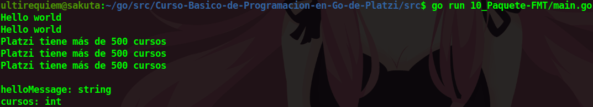

# fmt
El paquete [fmt](https://golang.org/pkg/fmt) es el que se encarga de administrar los inputs y outputs de la terminal.

## Tipos de Print:
- Println: Es un print normal con un salto de linea al final. Ejemplo:
```go
fmt.Println("Hola Mundo")
```
- Printf: Es un print al cual le puedes especificar el tipo de objeto que le vas a dar. Ejemplo:
```go
fmt.Printf("%s tiene más de %d cursos\n", nombre, cursos)
```
- Sprintf: No imprime nada en consola, simplemente lo guarda como un String. Ejemplo de uso:
```go
var message string = fmt.Sprintf("%v tiene más de %v cursos\n", nombre, cursos)
fmt.Println(message)
```
## Imprimir el tipo de dato:
Con este paquete podemos imprimir en consola el tipo de dato de variables o constantes. Ejemplo de uso:
```go
package main

import "fmt"

func main() {

	const nombre string = "UltiRequiem"

	fmt.Printf("La variable 'nombre' es de tipo : %T\n", nombre)
}
```

<div align="center">
<a href="https://youtu.be/vhL91VdPSI8"></a>
</div>

## Continua la lectura:
- [Capitulo Anterior: Calcular el Área de un Circulo](./../09_Area-Circulo)                                                                 

- [Capitulo Siguiente: Funciones](./../11_Funciones)