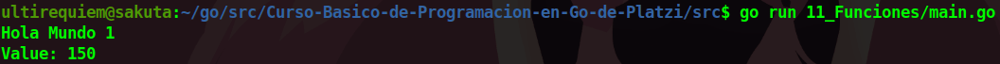

# Funciones 
Las funciones nos ayudan a no repetir tanto el codigo y  hacerlo mas legible.

## Continua la lectura:
- [Capitulo Anterior: El Paquete fmt](./../10_Paquete-FMT)                                                                 

- [Capitulo Siguiente: Calcular el Área con Funciones](./../12_Area-Funciones)
