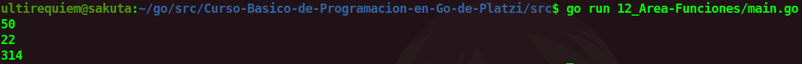

# Calcular el área de las figuras con funciones
En este programa hallaremos el areá de diversas figuras haciendo uso de las funciones.

## Continua la lectura:
- [Capitulo Anterior: Funciones](./../11_Funciones)                                                                 

- [Capitulo Siguiente: El Ciclo For](./../13_For)